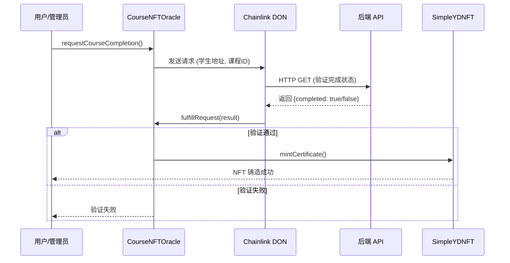

# 课程完成验证预言机系统

## 概述

这是一个基于 Chainlink Functions 的去中心化预言机系统，用于自动化验证学生课程完成状态并铸造 NFT 证书。

### 核心功能

- **链下验证**: 通过 Chainlink Functions 调用后端 API 验证学生课程完成状态
- **自动铸造**: 验证通过后自动为学生铸造课程证书 NFT
- **批量处理**: 支持批量请求多个学生的课程验证
- **可定制**: JavaScript 源代码可更新，适应不同的验证逻辑

## 文件结构

```
contract/
├── contracts/
│   ├── CourseNFTOracle.sol          # 预言机回调合约
│   └── tokens/
│       └── SimpleYDNFT.sol          # NFT 证书合约
├── scripts/
│   ├── deploy-oracle.js             # 部署脚本
│   └── interact-oracle.js           # 交互脚本
├── chainlink-functions-source.js    # Chainlink Functions JavaScript 源代码示例
├── ORACLE_DEPLOYMENT_GUIDE.md       # 详细部署指南
└── ORACLE_README.md                 # 本文件
```

## 快速开始

### 1. 安装依赖

```bash
npm install @chainlink/contracts
```

### 2. 配置环境变量

创建 `.env` 文件:

```bash
# 网络 RPC
SEPOLIA_RPC_URL=https://sepolia.infura.io/v3/YOUR_KEY
PRIVATE_KEY=your_private_key

# Chainlink Functions 订阅 ID
SEPOLIA_SUBSCRIPTION_ID=12345

# NFT 元数据 URI
BASE_TOKEN_URI=https://api.web3university.com/metadata/

# 合约地址 (部署后填写)
ORACLE_ADDRESS=
NFT_ADDRESS=

# 是否验证合约
VERIFY=true
```

### 3. 部署合约

```bash
npx hardhat run scripts/deploy-oracle.js --network sepolia
```

### 4. 添加 Consumer

在 [Chainlink Functions Dashboard](https://functions.chain.link/) 中将预言机合约添加为 Consumer。

### 5. 请求课程验证

```bash
npx hardhat run scripts/interact-oracle.js --network sepolia
```

## 工作流程



## 合约接口

### CourseNFTOracle

#### 主要函数

```solidity
// 请求单个课程验证
function requestCourseCompletion(
    address student,
    uint256 courseId,
    string calldata courseName
) external returns (bytes32 requestId);

// 批量请求课程验证
function batchRequestCourseCompletion(
    address[] calldata students,
    uint256[] calldata courseIds,
    string[] calldata courseNames
) external returns (bytes32[] memory requestIds);

// 查询请求详情
function getRequest(bytes32 requestId)
    external view returns (CourseCompletionRequest memory);

// 检查是否有待处理的请求
function hasPendingRequest(address student, uint256 courseId)
    external view returns (bool);
```

#### 事件

```solidity
// 请求发送事件
event RequestSent(
    bytes32 indexed requestId,
    address indexed student,
    uint256 indexed courseId,
    string courseName
);

// 请求完成事件
event RequestFulfilled(
    bytes32 indexed requestId,
    address indexed student,
    uint256 indexed courseId,
    bool success,
    uint256 tokenId
);
```

### SimpleYDNFT

#### 主要函数

```solidity
// 铸造课程证书 NFT (仅 owner 可调用)
function mintCertificate(
    address to,
    uint256 courseId,
    string memory courseName,
    uint256 completionTime
) external onlyOwner returns (uint256);

// 查询用户拥有的所有 NFT
function getTokensByOwner(address ownerAddr)
    external view returns (uint256[] memory);

// 获取证书信息
function getCertificate(uint256 tokenId)
    external view returns (Certificate memory);

// 检查用户是否拥有某课程的证书
function hasCertificate(address student, uint256 courseId)
    external view returns (bool);
```

## Chainlink Functions JavaScript

### 基本模板

```javascript
// 获取参数
const studentAddress = args[0];
const courseId = args[1];

// 调用 API
const response = await Functions.makeHttpRequest({
  url: `https://api.example.com/courses/${courseId}/students/${studentAddress}/completion`,
  method: "GET"
});

// 处理响应
if (response.error) {
  throw Error("API request failed");
}

// 返回结果
return Functions.encodeUint256(response.data.completed ? 1 : 0);
```

### 使用 Secrets (API Keys)

```javascript
const response = await Functions.makeHttpRequest({
  url: apiUrl,
  method: "GET",
  headers: {
    "Authorization": `Bearer ${secrets.API_KEY}`
  }
});
```

## 后端 API 要求

### API 端点格式

```
GET /courses/{courseId}/students/{studentAddress}/completion
```

### 响应格式

```json
{
  "completed": true,
  "completedAt": "2024-01-15T10:30:00Z",
  "progress": 100
}
```

### 状态码

- `200 OK`: 请求成功
- `404 Not Found`: 学生或课程不存在
- `500 Internal Server Error`: 服务器错误

## 测试

### 单元测试示例

```javascript
describe("CourseNFTOracle", function () {
  it("Should request course completion", async function () {
    const tx = await oracle.requestCourseCompletion(
      student.address,
      101,
      "Test Course"
    );

    const receipt = await tx.wait();
    const event = receipt.events.find(e => e.event === 'RequestSent');

    expect(event.args.student).to.equal(student.address);
    expect(event.args.courseId).to.equal(101);
  });
});
```

### 在测试网测试

```bash
# 部署到 Sepolia
npx hardhat run scripts/deploy-oracle.js --network sepolia

# 请求验证
npx hardhat run scripts/interact-oracle.js --network sepolia

# 查看事件
npx hardhat console --network sepolia
```

## 成本分析

### 一次性成本

- NFT 合约部署: ~2,000,000 gas (~$10-50 取决于 gas 价格)
- 预言机合约部署: ~3,000,000 gas (~$15-75)

### 运营成本

- 每次请求验证: ~150,000 gas (~$1-5)
- 每次 NFT 铸造: ~200,000 gas (由 LINK 支付)
- Chainlink Functions: ~0.1-0.5 LINK/请求

### 成本优化建议

1. **批量处理**: 使用 `batchRequestCourseCompletion` 可节省约 30% gas
2. **订阅充值**: 一次性充值较多 LINK 以获得更好的汇率
3. **gas limit 优化**: 根据实际需求调整 gasLimit 参数

## 安全考虑

### 智能合约安全

- ✅ 访问控制: 使用 `onlyOwner` 修饰符
- ✅ 重入保护: 状态更新在外部调用之前
- ✅ 输入验证: 验证所有输入参数
- ✅ 错误处理: 使用 try-catch 处理外部调用

### API 安全

- ✅ HTTPS: 所有 API 调用使用 HTTPS
- ✅ 认证: 使用 API Key 或 JWT 认证
- ✅ 限流: 防止 API 滥用
- ✅ 数据验证: 验证返回数据的完整性

### 预言机安全

- ✅ DON 去中心化: 使用多个节点达成共识
- ✅ 订阅管理: 定期检查 LINK 余额
- ✅ 请求去重: 防止重复请求

## 监控和维护

### 监控指标

1. **LINK 余额**: 确保订阅有足够的 LINK
2. **请求成功率**: 监控 fulfillRequest 成功率
3. **API 响应时间**: 确保在超时限制内
4. **NFT 铸造成功率**: 监控铸造失败原因

### 告警设置

```javascript
// 监控 LINK 余额
if (linkBalance < MIN_BALANCE) {
  sendAlert("LINK balance low");
}

// 监控请求失败
oracle.on("RequestFulfilled", (requestId, student, courseId, success) => {
  if (!success) {
    logError(`Request ${requestId} failed for student ${student}`);
  }
});
```

## 故障排查

### 常见问题

| 问题 | 原因 | 解决方法 |
|------|------|----------|
| 请求失败 | LINK 余额不足 | 向订阅充值 LINK |
| 回调未执行 | Consumer 未添加 | 在 Dashboard 中添加 Consumer |
| API 超时 | API 响应慢 | 优化 API 或增加超时设置 |
| NFT 铸造失败 | 权限问题 | 检查预言机是否为 NFT owner |

### 调试技巧

1. 查看事件日志
2. 使用 Chainlink Functions Playground 测试 JavaScript
3. 本地模拟 API 响应
4. 检查订阅状态

## 升级和维护

### 合约升级

由于合约不可升级，建议:

1. 部署新版本合约
2. 更新前端指向新合约
3. 保留旧合约以维护历史数据

### JavaScript 源代码更新

```javascript
await oracle.updateSource(newSourceCode);
```

### 配置更新

```javascript
await oracle.updateConfig(
  newSubscriptionId,
  newGasLimit,
  newDonId
);
```

## 最佳实践

1. **测试网测试**: 在主网部署前充分测试
2. **渐进式发布**: 小批量测试后再大规模使用
3. **监控告警**: 设置完善的监控系统
4. **文档更新**: 保持文档与代码同步
5. **备份方案**: 准备手动铸造 NFT 的应急方案

## 参考资源

- [Chainlink Functions 官方文档](https://docs.chain.link/chainlink-functions)
- [Chainlink Functions GitHub](https://github.com/smartcontractkit/functions-hardhat-starter-kit)
- [Chainlink Functions Playground](https://functions.chain.link/playground)
- [SimpleYDNFT 合约](./contracts/tokens/SimpleYDNFT.sol)
- [CourseNFTOracle 合约](./contracts/CourseNFTOracle.sol)

## 支持

如有问题，请:

1. 查看 [部署指南](./ORACLE_DEPLOYMENT_GUIDE.md)
2. 访问 [Chainlink Discord](https://discord.gg/chainlink)
3. 提交 GitHub Issue

## 许可证

MIT License
